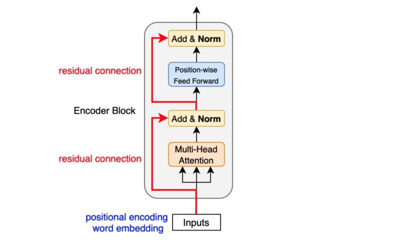

# GPT (Generative Pre-trained Transformer)

This folder contains an implementation of the GPT (Generative Pre-trained Transformer) model from scratch. The GPT model is a state-of-the-art language generation model based on the Transformer architecture, introduced by Vaswani et al. in the paper [Attention Is All You Need](https://arxiv.org/abs/1706.03762).

## Overview
The GPT model is a deep learning-based language model that uses unsupervised pre-training on a large corpus of text data, followed by fine-tuning on specific downstream tasks such as language translation, question answering, and text completion. It leverages the Transformer architecture, which utilizes self-attention mechanisms to capture dependencies between words or tokens in a sentence.

I implemented the GPT model in the `gpt.py` file in gpt folder. The implementation includes all the necessary components, such as the Transformer encoder, positional encoding, self-attention, feed-forward neural networks, and the generation pipeline.

## Architecture Diagram

The above diagram illustrates the high-level architecture of the GPT model. It consists of several stacked Transformer encoder layers, where each layer comprises multi-head self-attention and feed-forward neural networks. The input text is tokenized, and positional encoding is added to preserve the order of the tokens. The model is trained to predict the next token in a sequence given the previous tokens, enabling it to generate coherent and contextually relevant text.
